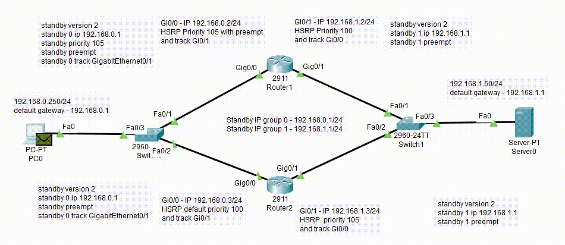
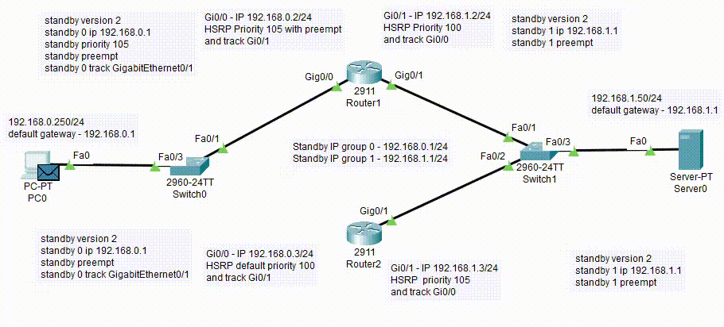
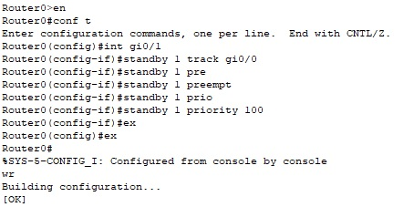
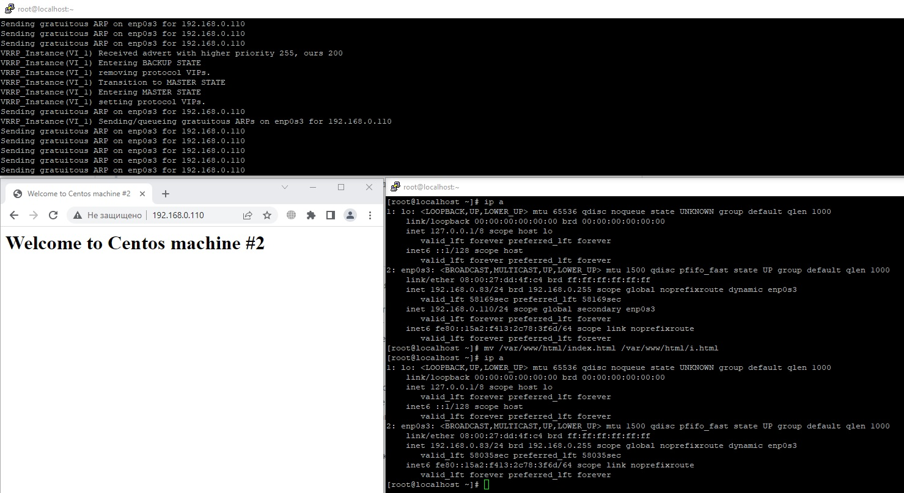

# Disaster recovery и Keepalived
## Домашнее задание. Горбунов Владимир

## Цель задания
1. Настраивать отслеживание интерфейса для протокола HSRP
2. Настраивать сервис Keepalived для использования плавающего IP


- [Задание 1. Cisco Packet Tracer. Протокол HSRP](#Задание-1)
- [Задание 2. Keepalived на Linux с сервером Nginx](#Задание-2)  
- [Задание 3. Keepalived, vrrp_track_file](#Задание-3)  


## Задание 1
>Дана схема для Cisco Packet Tracer, рассматриваемая в лекции.

>На данной схеме уже настроено отслеживание интерфейсов маршрутизаторов Gi0/1 (для нулевой группы)

>Необходимо аналогично настроить отслеживание состояния интерфейсов Gi0/0 (для первой группы).

>Для проверки корректности настройки, разорвите один из кабелей между одним из маршрутизаторов и Switch0 и запустите ping между PC0 и Server0.

>На проверку отправьте получившуюся схему в формате pkt и скриншот, где виден процесс настройки маршрутизатора.

Получившаяся схема pkt:

[hsrp.pkt](hsrp.pkt)

При связности сети между роутерами и свичами сигнал идет от PC0 из сети 192.168.0.0/24 в сторону сервера через роутер 1 а в обратную сторону из сети 192.168.1.0/24 через роутер 2:

Для этого на интерфейсах роутеров зеркально настроен параметр standby priority 100 и 105



При обрыве связи между одним из роутеров и свичом все пакеты идут через оставшийся роутер. 



Команды на роутере:



## Задание 2
>Запустите две виртуальные машины Linux, установите и настройте сервис Keepalived как в лекции, используя пример конфигурационного файла.

>Настройте любой веб-сервер (например, nginx или simple python server) на двух виртуальных машинах

>Напишите Bash-скрипт, который будет проверять доступность порта данного веб-сервера и существование файла index.html в root-директории данного веб-сервера.

>Настройте Keepalived так, чтобы он запускал данный скрипт каждые 3 секунды и переносил виртуальный IP на другой сервер, если bash-скрипт завершался с кодом, отличным от нуля (то есть порт веб-сервера был недоступен или отсутствовал index.html). Используйте для этого секцию vrrp_script

>На проверку отправьте получившейся bash-скрипт и конфигурационный файл keepalived, а также скриншот с демонстрацией переезда плавающего ip на другой сервер в случае недоступности порта или файла index.html

Конфигурация на которой в итоге выполнил домашнее задание:

CentOS 7, Keepalived v1.3.5, nginx/1.20.1

На скриншоте сверху - BACKUP сервер в дебаг режиме с выводом логов в консоль.
>/usr/sbin/keepalived -l -D -n

Внизу слева - страница в браузере с адресом VIP сервера, страница выводится со второй машины. 
Внизу справа - консоль второй машины. На сетевой интерфейсе enp0s3 висит адрес VIP, 
после перемещения файла index.html - этот адрес удаляется с интерфейса, а в логах бэкап сервера видна смена статуса. 




конфигурация keepalived MASTER:

[keepalived.conf](./keepalived.conf)

скрипт проверки наличия файла и открытого порта:

[check.sh](./check.sh)


Первоначально установил на **ubuntu 20.04.6 LTS**, **keepalived** из репозитория ubuntu, **nginx/1.18.0** 

И в этом сетапе keepalived отказывался работать корректно. 
С точно такими же настройками, как на CentOS7.
Все вирт.машины и с CentOS7, и с Ubuntu запускались через VirtualBox, сеть бриджом. 

Оба хоста переходили в состояние MASTER, при этом при проверке тспдампом видно, что пакеты с другого хоста приходят, в них указан приоритет другого хоста, но keepalived их игнорирует и в логи keepalived они попадают, в системных логах также ничего не нашлось.
```
Sat Jun  3 08:11:16 2023: Registering Kernel netlink reflector
Sat Jun  3 08:11:16 2023: Registering Kernel netlink command channel
Sat Jun  3 08:11:16 2023: Assigned address 192.168.0.79 for interface enp0s3
Sat Jun  3 08:11:16 2023: Assigned address fe80::a00:27ff:fe44:bba6 for interface enp0s3
Sat Jun  3 08:11:16 2023: Registering gratuitous ARP shared channel
Sat Jun  3 08:11:16 2023: (VI_1) removing VIPs.
Sat Jun  3 08:11:16 2023: Starting VRRP child process, pid=1193
Sat Jun  3 08:11:16 2023: Startup complete
Sat Jun  3 08:11:16 2023: VRRP sockpool: [ifindex(  2), family(IPv4), proto(112), fd(12,13) multicast, address(224.0.0.18)]
Sat Jun  3 08:11:16 2023: VRRP_Script(check_index_port) succeeded
Sat Jun  3 08:11:16 2023: (VI_1) Entering BACKUP STATE
Sat Jun  3 08:11:20 2023: (VI_1) Receive advertisement timeout
Sat Jun  3 08:11:20 2023: (VI_1) Entering MASTER STATE
```

Пробовал установить на эти же **ubuntu 20.04.6 LTS** keepalived из исходников:

https://keepalived.org/software/keepalived-2.2.8.tar.gz <br>
Сконфигурирован был с опцией ./configure /usr/lib/systemd/system/keepalived.service<br>
и добавлен в качестве системного юнита:<br>
[keepalived.service](./keepalived.service)

Это не решило проблему, и по-прежнему оба хоста показывали состояние MASTER и не видели пакеты от другого хоста. 

Также пробовал изменить системные параметры, касающиеся обработки IP трафика
```
net.ipv4.ip_nonlocal_bind=1 
net.ipv4.conf.all.rp_filter=0 
net.ipv4.conf.default.rp_filter=0 
net.ipv4.conf.enp0s3.rp_filter=0
```

В итоге ничего не помогло и домашнее задание выполнил на CentOS 7, на которой всё запустилось с первого раза. 


## Задание 3
>Изучите дополнительно возможность Keepalived, которая называется vrrp_track_file

>Напишите bash-скрипт, который будет менять приоритет внутри файла в зависимости от нагрузки на виртуальную машину (можно разместить данный скрипт в cron и запускать каждую минуту). Рассчитывать приоритет можно, например, на основании Load average.

>Настройте Keepalived на отслеживание данного файла.

>Нагрузите одну из виртуальных машин, которая находится в состоянии MASTER и имеет активный виртуальный IP и проверьте, чтобы через некоторое время она перешла в состояние SLAVE из-за высокой нагрузки и виртуальный IP переехал на другой, менее нагруженный сервер.

>Попробуйте выполнить настройку keepalived на третьем сервере и скорректировать при необходимости формулу так, чтобы плавающий ip адрес всегда был прикреплен к серверу, имеющему наименьшую нагрузку.

>На проверку отправьте получившийся bash-скрипт и конфигурационный файл keepalived, а также скриншоты логов keepalived с серверов при разных нагрузках


